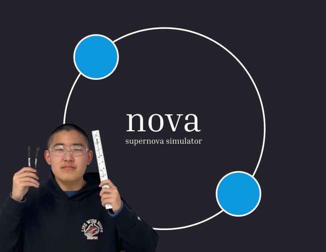

## Credits

This project builds upon the base simulator from [kavan010/gravity_sim](https://github.com/kavan010/gravity_sim).

Inspiration and Some Logic from [Eclipsing Binary Simulator](https://ccnmtl.github.io/astro-simulations/eclipsing-binary-simulator/).

Some (Majority) of Calculus and Trig. done by [Gemini](https://gemini.google.com).

Orbiting logic based on [this](https://github.com/ccnmtl/astro-simulations).

## How to Run 

To run this simulation do the following steps:

1. Install [VS Code](https://code.visualstudio.com/download)

2. Install [GNU](https://www.gnu.org/software/software.html)

3. Install [CMake](https://cmake.org/download/)

3. Once GNU + VS Code are installed, open VS Code and install the [C/C++ Extension Pack](https://marketplace.visualstudio.com/items?itemName=ms-vscode.cpptools-extension-pack)

4. The extension pack will walk you through some configuration steps, follow them until the create your first file step.

5. At this point a small arrow/run button should have appeared in the bottom left of your VS Code, click this button. It will run for the first time and install all the needed dependencies 

6. Now click the same arrow/run button from step 5 and then a pop-up window should appear, encompasing the simulator

# To Do List:

## Hackatime Stats

